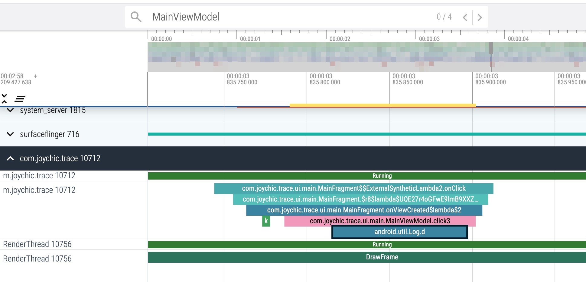

# # TraceTools
MTrace is an Android dynamic ATrace tool that utilizes ART method hooks. Work with [Perfetto](https://perfetto.dev/docs/), which allows you to collect system-wide performance traces from Android devices from a variety of data sources (kernel scheduler via ftrace, userspace instrumentation via atrace and all other data sources listed in this site).


### Getting Started
#### Installation Via Maven
Add the following lines to build.gradle on your app module:
```
dependencies {
   implementation 'io.gitee.joychic:TraceTools:0.0.3'
}
```

### Quick Tutorial
  
start Trace :
```agsl
adb shell am broadcast -a TRACE.ACTION_START -f 0x01000000
```

close Trace :
```agsl
   adb shell am broadcast -a TRACE.ACTION_STOP -f 0x01000000
```

with multi user mode, use `--user` send action 
```agsl
  adb shell am broadcast --user 0 -a TRACE.ACTION_START  [package]
```

#### [Download record_android_trace](https://perfetto.dev/docs/quickstart/android-tracing)

On Linux and Mac:
```
curl -O https://raw.githubusercontent.com/google/perfetto/main/tools/record_android_trace
```
then, chmod record_android_trace
> chmod u+x record_android_trace

you can also add alias to your `.bashrc` or `.zshrc`

``` 
alias perfetto='${ANDROID_HOME}/record_android_trace -o trace_file.perfetto-trace -t 20s -b 1024mb  gfx input view webview wm am sm audio video camera dalvik rs bionic sched freq idle disk load sync binder_lock'
```

On Windows:
```
curl -O https://raw.githubusercontent.com/google/perfetto/main/tools/record_android_trace
```


#### Recording a trace
```
 perfetto -a com.joychic.trace
```
replace `com.joychic.trace` with your application

when finished, press `Control+C`    `https://ui.perfetto.dev/#!/record/cpu`

### Performance
